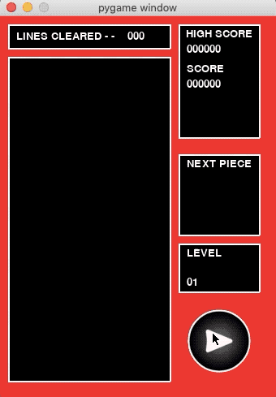

# Tetris Python

A Tetris clone coded in Python, using the [Pygame](https://www.pygame.org/news) library.

Originally used for a programming project in A-level Computer Science.

## Demo run of the game

## Objective
Clear as many lines as possible in order to rack up a high score. The more lines cleared simultaneously, the greater the number of points scored.

The blocks will fall faster as the level increses. Avoid letting them stack up too high, which will cause the game to end.

## Controls

* `Left Arrow`: Move left. Hold for quick movement.

* `Right Arrow`: Move right. Hold for quick movement.

* `Down Arrow`: Fast drop.

* `X key`: Rotate clockwise.

* `Z key`: Rotate anticlockwise.

* `Escape key`: Toggle pause. Alternatively, click the pause button.

## Score System
The points for clearing lines depends on the current level and the number of lines cleared:

`points = level * base`.

The `base` values for each line are as follows:
* `1 line  = 40 points`
* `2 lines = 100 points` 
* `3 lines = 300 points`
* `4 lines = 1200 points`

Also one point is given for every space fallen while fast dropping. 

## Credits

[Pygame](https://www.pygame.org/news): the Python library used as a framework for coding the game.

[Hard Drop (Tetris Wiki)](https://harddrop.com/wiki/Tetris_Wiki): the main source used for researching Tetris.

[game-icons.net](https://game-icons.net/) (Guard13007): the source of the pause and resume buttons.
